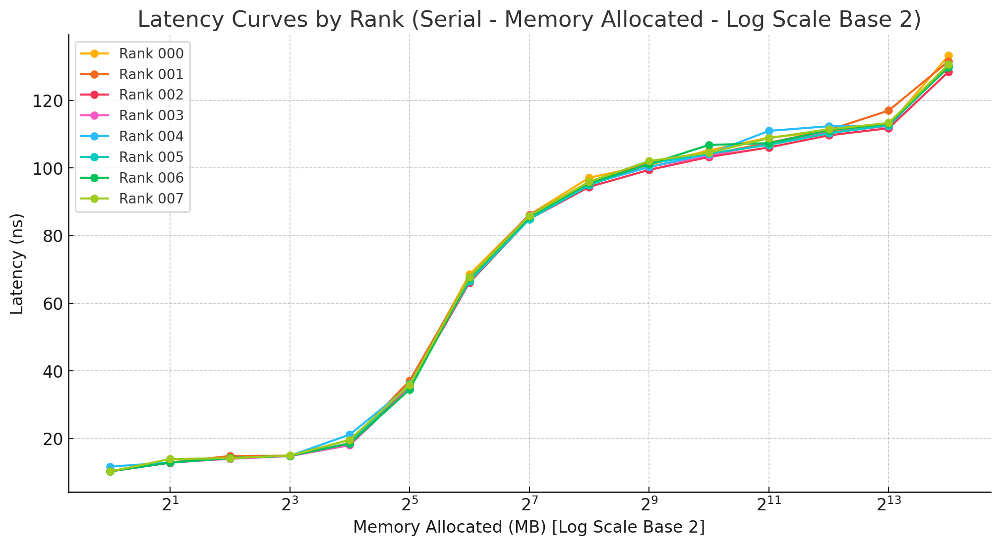

# NUMA Memory Latency Benchmarking Analysis

## Test Configuration

Two experiments were conducted with identical system configurations but different execution modes:

1. **Concurrent Mode**: All processes run memory benchmarks simultaneously
2. **Serial Mode**: Processes run one at a time to isolate memory subsystem access

Both benchmarks were executed with similar commands:

**Concurrent Mode:**
```bash
srun -t "00:60:00" --nodes 1 --ntasks 8 --cpu-bind=map_cpu:1,9,17,25,33,41,49,57 --hint=nomultithread ./run_numa.sh --numa=0,0,1,1,2,2,3,3 --verbose -- --size=1-16384
```

**Serial Mode:**
```bash
srun -t "00:60:00" --nodes 1 --ntasks 8 --cpu-bind=map_cpu:1,9,17,25,33,41,49,57 --hint=nomultithread ./run_numa.sh --numa=0,0,1,1,2,2,3,3 --verbose -- --size=1-16384 --serial
```

### System Specifications
- **CPU**: AMD EPYC 7A53 64-Core Processor
- **CPU Family**: 25
- **Thread(s) per core**: 2
- **Core(s) per socket**: 64
- **Socket(s)**: 1
- **NUMA node(s)**: 4

### Cache Hierarchy
```
Caches (sum of all):     
  L1d:                   2 MiB (64 instances)
  L1i:                   2 MiB (64 instances)
  L2:                    32 MiB (64 instances)
  L3:                    256 MiB (8 instances)
```

- **L1 Cache**: Each core has dedicated 32KB L1 data and 32KB L1 instruction caches
- **L2 Cache**: Each core has a dedicated 512KB L2 cache
- **L3 Cache**: 8 instances of 32MB L3 cache (one per CCD), shared among cores within each CCD
- **Cache Distribution**: 2 CCDs (Core Complex Dies) per NUMA node, each with a 32MB L3 cache

### AMD EPYC Architecture Overview


AMD EPYC processors use a multi-chiplet design where each NUMA domain contains multiple CCDs (Core Complex Dies), each with its own L3 cache and memory access paths. These CCDs are further divided into CCXs (Core CompleXes), creating a hierarchical topology that can significantly impact memory access patterns and latencies depending on which specific core is accessing memory.

In the EPYC 7A53, each NUMA node contains 2 CCDs, and each CCD has its own 32MB L3 cache. This chiplet design means that even within a single NUMA domain, some cores may have different latency characteristics when accessing memory, especially if they need to communicate across CCDs.

### NUMA Node CPU Distribution
- **NUMA node0**: CPUs 0-15,64-79
- **NUMA node1**: CPUs 16-31,80-95
- **NUMA node2**: CPUs 32-47,96-111
- **NUMA node3**: CPUs 48-63,112-127

### Test Strategy
In both experiments, we bound each process's memory allocation to its local NUMA domain. The mapping was as follows:
- Ranks 0 and 1: Run on cores 1 and 9 (NUMA domain 0), memory bound to domain 0
- Ranks 2 and 3: Run on cores 17 and 25 (NUMA domain 1), memory bound to domain 1
- Ranks 4 and 5: Run on cores 33 and 41 (NUMA domain 2), memory bound to domain 2
- Ranks 6 and 7: Run on cores 49 and 57 (NUMA domain 3), memory bound to domain 3

This configuration ensures that each process accesses memory within its local NUMA domain, allowing us to establish baseline latency measurements for local memory access.

## Concurrent Mode Results

### Raw Results Table

Here's the output from the concurrent execution mode:

```
 ========================================================================================================================================================================================
|  MPI  |        CPU     |              MEMORY    |                                                             LATENCY (ns)                                                             |
|-------|---------|------|----------------|-------|--------|--------|--------|--------|--------|--------|--------|--------|--------|--------|--------|--------|--------|--------|--------|
| Ranks | Cores   | NUMA |     Address    | NUMA  | 1MB    | 2MB    | 4MB    | 8MB    | 16MB   | 32MB   | 64MB   | 128MB  | 256MB  | 512MB  | 1024M  | 2048M  | 4096M  | 8192M  | 16384M |
|-------|---------|------|----------------|-------|--------|--------|--------|--------|--------|--------|--------|--------|--------|--------|--------|--------|--------|--------|--------|
|  000  | 1       |   0  | 0x527e70       |   0   | 11.53  | 12.92  | 14.25  | 14.93  | 18.67  | 37.73  | 72.45  | 108.77 | 105.56 | 114.71 | 154.92 | 164.07 | 178.93 | 171.25 | 130.76 |
|  001  | 9       |   0  | 0x526920       |   0   | 11.43  | 12.93  | 14.26  | 14.94  | 18.59  | 37.00  | 68.22  | 87.39  | 98.07  | 103.95 | 104.90 | 110.13 | 112.31 | 116.69 | 156.56 |
|  002  | 17      |   1  | 0x526960       |   1   | 11.48  | 12.93  | 14.24  | 14.96  | 18.60  | 37.64  | 68.62  | 108.25 | 98.41  | 120.04 | 149.20 | 162.67 | 183.60 | 164.67 | 155.69 |
|  003  | 25      |   1  | 0x526940       |   1   | 11.16  | 12.99  | 14.23  | 14.93  | 18.72  | 37.32  | 68.17  | 87.64  | 102.25 | 103.49 | 104.50 | 109.08 | 111.92 | 117.30 | 130.77 |
|  004  | 33      |   2  | 0x5269d0       |   2   | 11.47  | 12.93  | 14.21  | 14.93  | 18.51  | 36.19  | 75.32  | 85.91  | 122.77 | 120.02 | 147.15 | 164.27 | 180.87 | 170.07 | 156.06 |
|  005  | 41      |   2  | 0x526960       |   2   | 11.06  | 12.93  | 14.28  | 14.92  | 18.73  | 35.80  | 68.15  | 104.83 | 97.64  | 102.93 | 104.26 | 110.72 | 111.84 | 115.56 | 129.24 |
|  006  | 49      |   3  | 0x5269c0       |   3   | 11.47  | 12.95  | 14.25  | 14.96  | 18.62  | 36.97  | 78.35  | 86.35  | 108.96 | 109.47 | 153.43 | 164.00 | 170.84 | 163.13 | 156.71 |
|  007  | 57      |   3  | 0x5269c0       |   3   | 11.19  | 12.95  | 14.24  | 14.94  | 18.69  | 35.51  | 67.74  | 92.91  | 98.20  | 102.17 | 103.98 | 109.08 | 112.20 | 116.15 | 129.43 |
 ========================================================================================================================================================================================
```

### Analysis of Concurrent Mode Results


The test measured memory latency across 15 different allocation sizes, from 1MB to 16384MB. Several clear patterns emerge:

1. **Small Allocations (1-16MB)**: Very little variation between NUMA domains at these size. L1 (32KB) and L2 (512KB) cache effects are not clearly visible at the tested size granularity, as all tested sizes exceeded L2 capacity

2. **Medium Allocations (32-64MB)**:32MB represents the size of a single L3 cache in a CCD. The jump at 32MB (from ~18ns to ~36ns) occurs when data exceeds a single L3 cache but might still fit in the two L3 caches (64MB total) within a NUMA node. 64MB shows the second significant jump (from ~36ns to ~68-78ns) when data exceeds the combined L3 capacity of a NUMA node, requiring full DRAM access

3. **Large Allocations (128MB-16384MB)**: Some domains (particularly even-numbered ranks) show significantly higher latencies for the largest allocation. At these sizes, the system is fully dependent on DRAM access patterns and memory controller behavior

### Latency Patterns Within NUMA Domains (Concurrent Mode)

An interesting pattern emerges when comparing pairs of ranks within the same NUMA domain:

- **Even-numbered ranks** (0, 2, 4, 6) generally show higher latencies for large allocations
- **Odd-numbered ranks** (1, 3, 5, 7) show more consistent latencies even at larger sizes

For example, at 4096MB:
- Rank 0: 178.93ns vs Rank 1: 112.31ns (both on NUMA domain 0)
- Rank 2: 183.60ns vs Rank 3: 111.92ns (both on NUMA domain 1)
- Rank 4: 180.87ns vs Rank 5: 111.84ns (both on NUMA domain 2)
- Rank 6: 170.84ns vs Rank 7: 112.20ns (both on NUMA domain 3)

This pattern can be explained by the internal CCD topology of the EPYC processor. Since each NUMA node has two CCDs, it's likely that even-numbered ranks and odd-numbered ranks are being scheduled on different CCDs within the same NUMA node. The data suggests that under concurrent load, cores in one CCD experience significantly higher memory access latencies than cores in the other CCD, despite both being in the same NUMA domain.

### Pattern Inversion at Extreme Allocation Size

A striking anomaly occurs at the largest tested allocation size (16384MB), where the otherwise consistent pattern between even and odd ranks inverts for NUMA domain 0:

- At 16384MB:
  - Rank 0: 130.76ns vs Rank 1: 156.56ns (pattern reversal)
  - Rank 2: 155.69ns vs Rank 3: 130.77ns (similar to usual pattern)
  - Rank 4: 156.06ns vs Rank 5: 129.24ns (similar to usual pattern)
  - Rank 6: 156.71ns vs Rank 7: 129.43ns (similar to usual pattern)

This unexpected crossover, where Rank 0 suddenly performs better than Rank 1 (by about 20%), suggests that at extreme memory sizes, the memory subsystem behavior changes significantly. Possible explanations include:

**Potential causes for the anomaly:**
* **Memory controller reallocation:** The system may dynamically reassign memory controller resources at capacity limits
* **Page table management:** Different strategies for handling very large memory regions may be employed
* **NUMA domain 0 special case:** As the boot CPU domain, node 0 may have special handling for extreme allocations
* **Routing topology changes:** Memory controller saturation may trigger different traffic routing decisions
* **Memory interleaving effects:** Large allocations may cross memory channel boundaries differently
* **IO proximity effects:** NUMA node 0 may have different characteristics due to its proximity to IO devices

This anomaly highlights that memory subsystem behavior is not entirely predictable and can change dramatically at extreme allocation sizes, which has important implications for applications that manage very large memory regions.

## Serial Mode Results

### Raw Results Table

Here's the output from the serial execution mode:

```
 ========================================================================================================================================================================================
|  MPI  |        CPU     |              MEMORY    |                                                             LATENCY (ns)                                                             |
|-------|---------|------|----------------|-------|--------|--------|--------|--------|--------|--------|--------|--------|--------|--------|--------|--------|--------|--------|--------|
| Ranks | Cores   | NUMA |     Address    | NUMA  | 1MB    | 2MB    | 4MB    | 8MB    | 16MB   | 32MB   | 64MB   | 128MB  | 256MB  | 512MB  | 1024MB | 2048MB | 4096MB | 8192MB | 16384MB|
|-------|---------|------|----------------|-------|--------|--------|--------|--------|--------|--------|--------|--------|--------|--------|--------|--------|--------|--------|--------|
|  000  | 1       |   0  | 0x527d60       |   0   | 10.49  | 12.92  | 14.26  | 14.98  | 18.70  | 36.17  | 68.53  | 86.12  | 97.13  | 100.92 | 105.18 | 108.98 | 110.84 | 112.50 | 133.20 |
|  001  | 9       |   0  | 0x526920       |   0   | 10.34  | 12.96  | 14.88  | 14.97  | 18.61  | 37.13  | 67.68  | 86.22  | 95.40  | 101.65 | 104.00 | 107.44 | 111.18 | 116.96 | 131.50 |
|  002  | 17      |   1  | 0x526940       |   1   | 10.36  | 12.90  | 14.23  | 14.95  | 18.40  | 35.49  | 66.15  | 84.91  | 94.41  | 99.44  | 103.25 | 106.07 | 109.63 | 111.75 | 128.44 |
|  003  | 25      |   1  | 0x526940       |   1   | 10.35  | 12.95  | 14.03  | 14.84  | 18.07  | 34.95  | 67.61  | 85.99  | 95.46  | 100.30 | 103.69 | 107.13 | 110.43 | 112.44 | 130.34 |
|  004  | 33      |   2  | 0x5269b0       |   2   | 11.76  | 12.94  | 14.24  | 14.94  | 21.20  | 35.55  | 67.57  | 85.06  | 95.22  | 100.28 | 104.15 | 110.96 | 112.34 | 112.42 | 130.33 |
|  005  | 41      |   2  | 0x526980       |   2   | 10.36  | 12.94  | 14.25  | 14.94  | 18.63  | 36.10  | 66.53  | 84.89  | 94.89  | 101.28 | 104.24 | 106.83 | 110.24 | 112.64 | 129.83 |
|  006  | 49      |   3  | 0x5269e0       |   3   | 10.36  | 12.95  | 14.29  | 14.93  | 18.53  | 34.52  | 67.43  | 85.54  | 95.48  | 101.12 | 106.81 | 107.32 | 111.13 | 113.05 | 129.72 |
|  007  | 57      |   3  | 0x5269a0       |   3   | 10.32  | 14.00  | 14.22  | 15.00  | 19.66  | 35.90  | 67.78  | 85.91  | 95.96  | 102.04 | 104.53 | 108.81 | 111.44 | 113.30 | 130.60 |
 ========================================================================================================================================================================================
```

### Analysis of Serial Mode Results



The serial mode test shows several notable differences from the concurrent mode while still exhibiting similar cache-related thresholds:

1. **Small Allocations (1-16MB)**: Similar to concurrent mode, latencies remain low and consisten. These sizes still fit within a single L3 cache (32MB)
2. **Medium Allocations (32-64MB)**: Similar latency jumps at the cache boundaries. 32MB jump similar to concurrent mode (~18ns to ~35ns) as data exceeds a single L3 cache. Less variability between ranks compared to concurrent mode

3. **Large Allocations (128MB-16384MB)**: **Key Difference**: In serial mode, all ranks show remarkably consistent latencies. No significant difference between even and odd-numbered ranks.

#### Latency Patterns Within NUMA Domains (Serial Mode)

Unlike in concurrent mode, the serial mode shows:

- No significant difference between even and odd-numbered ranks
- Very consistent latency values across all cores
- Stable latency profile that generally increases with allocation size
- Maximum latency values that are significantly lower than in concurrent mode

For example, at 4096MB in serial mode:
- Rank 0: 110.84ns vs Rank 1: 111.18ns (compared to 178.93ns vs 112.31ns in concurrent mode)
- Rank 2: 109.63ns vs Rank 3: 110.43ns (compared to 183.60ns vs 111.92ns in concurrent mode)
- Rank 4: 112.34ns vs Rank 5: 110.24ns (compared to 180.87ns vs 111.84ns in concurrent mode)
- Rank 6: 111.13ns vs Rank 7: 111.44ns (compared to 170.84ns vs 112.20ns in concurrent mode)

This consistency in serial mode suggests that when memory controllers are not under concurrent pressure, the asymmetric behavior of different CCDs within the same NUMA domain disappears, leading to more uniform memory access latencies.

## Comparative Analysis: Concurrent vs. Serial Mode

The stark contrast between concurrent and serial execution modes reveals significant insights about memory access patterns in NUMA systems:

### 1. Memory Controller Contention

The most striking difference is observed in the even-numbered ranks (0, 2, 4, 6) at large allocation sizes:

- In **concurrent mode**, these ranks show latencies up to 70% higher than their odd-numbered counterparts
- In **serial mode**, these differences disappear completely

This strongly suggests memory controller contention when multiple processes access memory simultaneously. The EPYC 7A53's internal architecture appears to route memory access from even-numbered cores through shared pathways that experience congestion under concurrent load.

When we consider the cache hierarchy (two 32MB L3 caches per NUMA node), it's likely that cores from the same CCD share memory controllers, and the CCDs containing cores 1, 17, 33, and 49 (our even-numbered ranks) may have less efficient access to memory controllers under concurrent load.

### 2. Divergence Threshold

The point at which concurrent and serial results begin to diverge significantly is around 128MB:

- Below 128MB, both modes show relatively similar latency characteristics
- At and above 128MB, even-numbered ranks in concurrent mode begin showing elevated latencies
- The divergence becomes most pronounced beyond 1024MB

This indicates that memory controller saturation becomes a limiting factor primarily at larger allocation sizes, when memory bandwidth demands exceed what shared pathways can provide. The system's combined L3 cache capacity (256MB across all 8 CCDs) has minimal impact at these scales, as all tested sizes beyond 256MB must be serviced primarily from DRAM.

### 3. NUMA Domain Consistency

Both modes show consistent behavior within each NUMA domain:

- No significant latency differences between NUMA domains in either mode
- Similar latency progression patterns across memory sizes
- All domains exhibit the same even/odd rank patterns in concurrent mode

This confirms that the observed contention effects are related to the internal architecture of each NUMA domain rather than cross-domain interference. Each NUMA domain has identical cache hierarchy (two 32MB L3 caches), which explains the similar behavior across domains.

### 4. Cache-Related Thresholds

The latency jumps correlate strongly with the cache hierarchy of the AMD EPYC 7A53:

- **~16MB to 32MB transition**: Represents data exceeding half of a CCD's L3 cache capacity
- **~32MB to 64MB transition**: Represents data exceeding a single CCD's L3 cache (32MB) but potentially still fitting in two CCDs' combined L3 cache (64MB) within a NUMA node
- **Beyond 64MB**: Memory access patterns that cannot be effectively cached in the L3 caches and must rely on DRAM access

### 5. Implications for System Design

These results have important implications for application design on NUMA systems:

- Memory-intensive applications may benefit from serialized memory operations for large allocations
- Process placement within NUMA domains matters significantly under concurrent load
- Even with local NUMA access, memory controller topology can create "hot spots"
- Applications using even-numbered cores may experience higher memory latency under concurrent load
- Memory allocation sizes should be considered in relation to cache boundaries (particularly the 32MB L3 cache size)

## NUMA Statistics Correlation

The NUMA statistics from both tests confirm proper memory binding. For example, from the serial mode test (Rank 7):

```
Per-node process memory usage (in MBs) for PID 57724 (numa_bench)
                         Node 0          Node 1          Node 2          Node 3           Total
                --------------- --------------- --------------- --------------- ---------------
Huge                       0.00            0.00            0.00            0.00            0.00
Heap                       0.00            0.00            0.00        16386.97        16386.97
Stack                      0.00            0.00            0.00            0.02            0.02
Private                    7.95            1.99            2.36            3.48           15.78
----------------  --------------- --------------- --------------- --------------- ---------------
Total                      7.95            1.99            2.36        16390.46        16402.77
```

This confirms that the heap memory (which contains our benchmark allocation) is correctly bound to NUMA domain 3 for Rank 7. The small amounts of memory on other nodes primarily represent private mappings like code segments, which have minimal impact on the benchmark results.

## Conclusion

This dual-mode experiment reveals important characteristics of memory access on the AMD EPYC 7A53 platform:

1. **Cache hierarchy effects** are clearly visible, with performance thresholds at 16MB, 32MB, and 64MB corresponding to L3 cache boundaries
2. **DRAM access patterns** become evident at medium and large sizes once L3 cache capacity is exceeded
3. **Memory controller contention** creates significant latency variations in concurrent mode, particularly for even-numbered cores
4. **Memory latency stability** is achieved in serial mode across all cores and NUMA domains
5. **CCD topology within NUMA domains** has a significant impact on memory performance, creating asymmetric behavior under load

Most importantly, these results highlight that NUMA optimization requires consideration not just of node binding but also of how cores within a NUMA domain access memory controllers. The even/odd latency pattern observed in concurrent mode suggests an asymmetric memory controller design that creates "fast" and "slow" paths under heavy load, likely related to the multi-chiplet design where each NUMA domain contains two separate CCDs.

These findings provide valuable guidance for high-performance computing applications, suggesting that memory-intensive workloads should consider both NUMA binding and core selection for optimal performance, as well as working within cache size boundaries when possible. 
